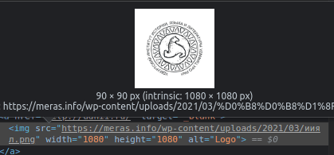
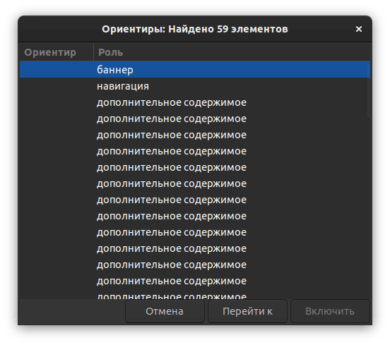
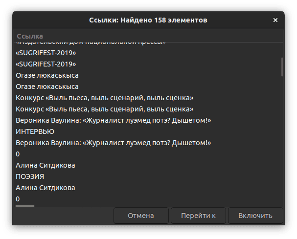

<dfn>Могӟонтэмлык</dfn>, яке англи кылын вераса <dfn>accessibility</dfn> 
(ӵемысь вакчиятэмын «a11y» кадь) — вотэсбамлэн одӥгез кулэлыко аслыкез, макем 
сое кутылыны каньыл но капчи, вань-а кыӵе ке могӟонъёс.

Со паськыт арбери но, пӧртэмесь могӟон люкетъёс вань. Огъя малпамлэсь пӧртэм 
луыса, могӟонтэмлык синтэм юзчиос сярысь гинэ ӧвӧл (соос сярысь но малпаськоно 
ке но). Ваньмылэн, луоз, таӵе югдуре сюреммы вань: кыӵе ке вотэсбамез пелепонэн 
учкыса, уно сое отчы-татчы берыкъялляно луэ, ваньзэ лыдӟыны-учкыны понна. 
Чыры-пыры кадь но, ӝож ай.

Вотэс асьме дыре ӝог азьлане мынэ но, али вотэсэ потэммы луэ пӧртэм 
лэсьтэтъёсын. Огзэ но санэ понытэк кельтонтэм. Я, со кылӥськем кем секыт ӧвӧл — 
тросэз ужпум HTML {валэктон}ъя каронтэмысь потэмын.

* * *

Туннэ могӟонтэмлык ласянь ӵем пумиськылӥсь янгышъёсты одӥг-ог удмурт 
вотэсгердъёсысь возьматыса валэкто. Татчы пыремъёслэн лэсьтӥсьёссы асьсэзы 
ултӥямын медаз кожалэ, ваньмыз эш мылкыдын луэ!

<aside>

Мон нокызьы вотэсгердъёслэсь пуштроссэ уг курласькы. Котьма ке но, удмуртлык 
сярысь вотэсысь тодымон карон — туж бадӟым уж. Нош асьмелэн, 
вотэслэсьтӥсьёслэн, ужмы — сое кызьы луэ озьы умой-умой лэсьтыны.

</aside>

## Дӥватоз

Дӥватоз шуо `<div>` {пусъет}эз укыр уно кутылонэз.

[Merás][meras] но, [Инвожо][invozho] но вотэсгердъёс потӥсь менюзэс усьтыны
нюртонэз малы ке озьы  ик пусйиллям — я, Инвожолэн со `<span>`, — HTML:лэн аслаз 
{вачекуспаськись} элементъёслы пусъетъёсыз вань 
дыръя. Ярам, ас кожады вачекуспаськонэз лэсьтэмды потэм но котькинлэн сое 
кутэмез мед луоз шуыса кариллямды ке (малы — мукетыз ни юан). Но татын озьы уг 
луы. Отчы {нюртэтпул}эн сюронтэм, зэмос вачекуспаськись 
элементъёс сямен ик соос Tab-черодэ уг сюро бере. Сое `tabindex="0"` атрибут 
ватсаса тупатыны луысал:

```html
<span id="show-menu" title="Меню" tabindex="0">
  <i class="menui-"></i>
</span>
```

Нош таиныд со уг йылпумъяськы. `click` учырез чалкаса сяна нюртон зӥбонэз но 
чаклано: `Enter` но `Space`. Вакчияк вераса, капчи гинэ луоз `<button>` кутыны.

## Фокус

Татын ӧжыт веранэз. Кемалась ик ӧвӧл вал сыӵе вакыт, ку ваньмыз фокусэз ватоз
вал, нош мукет дыръёс вуиллям. Одӥг но вотэсгерд фокусэлэсь кытын луэмзэ уг
возьматы.

{Вотэсучкон}ъёс таре ӝикыт гинэ фокусэз возьматыны амал сёто. Етӥзлыкынызы соос 
валало, вотэсбамен вачекуспаськом нюртэтпулэн-а, мукет макеен-а мынэ но, соя 
фокусэз возьмато яке вато, [`focus-visible` псэудокласс][focus] вошъяса. 

## Потӥсь менюос

Merás но [Удмурт Дунне][udmdunne] вотэсгердъёсын потӥсь менюос огшоры гинэ класс 
ватсамен-куштэмен лэсьтэмын. Озьы гинэ вераса номыриз но урод ӧвӧл, нош соос 
ворсамын дыръя но блок луо. Озьыен, мынам Tab:ен отчы сюреме луэ но, мон 
кытынме ум адӟы (экранлыдӟонэн пырасьёслы соин каньылгес луоз).

Кык шонертонэз вань: я меню ватэмын дыръя сое тыпак `display: none` кароно 
(Инвожо вотэсгердын кадь ик), я пушказ фокус вань дыръя сое юри усьтоно.

## Alt-тэкст

Куинь вотэсгердысь суредъёслы воштӥсь текст лэсьтыны куинь пӧртэм амал шедьтӥ, 
огзэ но умой ӧй шуысал:

- Удмурт Дунне: alt:э ужкагазним сюре кадь, йылаз-пумаз одӥг кыл гинэ верамон 
  (ксь, «газ-1». Мар газ?)
- Инвожо: статьяослэсь валтӥсь суредзэс сяна адӟеме ӧвӧл, соос ай статьялэсь 
  нимзэ нулло. Маиз умойтэм — огшапскын валэкто.
- Merás: тыпак номыр, дорбамысьтызы юлтошъёссылэн логооссы сяна — соос озьы 
  гинэ «Logo» шуыса валэктэмын луо (кинлэн логоез?).

<figure class="float-left">

</figure>

Вань ай синмо но пырасьёслы пайдаез: суред кыскиськыны луонтэм дыръя, со интые 
ик alt-тэкст луоз.

Озьы ик валэктытэк кельтэм {покчипус}ъёс шедьтӥ. Азьвыл ик верам 
меню усьтон, кылсярысь. Синтэм пырась марзэ-малызэ уз вала, отын чик тэксто 
пуштрос ӧвӧлэн. Сое тупатыны капчи — `aria-label` атрибут ватсаса.

## `lang`

Merás вотэсгердысь ушъямонэз — `lang` атрибутын `udm` гожтэмзы.

```html
<html lang="udm-UDM">
```

Кылсярысь, Удмурт Дуннелэн вотэсгердаз, тыпак удмуртэн гожъякузы, отын малы ке 
`ru` гожъямын. Малы со кулэ? Я, кытын ке азьланяз удмурт тэкст-куара кылдыку, 
синтэм яке ляб адӟись пырасьёс чебер удмурт куараез кылозы. Сотэк програма 
вотэсбамез ӟуч кожалоз но, <span data-latin-skip>ӴӦӜӤӞ</span> луоз
«<span data-latin="Cyrillic letter CHE with diaeresis">Кирилӥк лэтэр Ч вис дӥэрезӥс</span>»
тус, кызьы со гожпусъёсты вераны тодытэк.

Нош отын ик тышкаськыны луоноез (ярам, сокем урод ӧвӧл, нош сэректэ монэ).
Окмоз кыл быръёнын гожъянэз <span data-latin-skip>Удмурт*СКИЙ*</span>!  «<span
data-latin-skip>Удмурт</span>» ке гожтысалды, 8 {тямысо} но шыръясалды
:кырмыштэ:

Инвожо журнал вотэсгердлэсь кылзэ мукет сямен пусйиллям — кык интыын: 
`og:locale` мета-пусъетын но `Content-Language` HTTP-воштосын.

```html
<!-- Локаль -->
<meta property="og:locale" content="udm_UDM" />
<meta property="og:locale:alternate" content="ru_RU" />
<meta HTTP-EQUIV="Content-language" CONTENT="udm-UDM" />
```

Нырысез утчанмашинаослы но мерлыко вотэсъёслы юрттэ но, соин номыриз но умойтэм 
ӧвӧл, нош [кыктэтӥез кутонтэм шуыса верамын][http-equiv]: со амал кабесэ уг 
пыры вал бере, пӧртэм вотэсучконъёс сое олокызьы валало.

## Инвожолэн статьякартаез

<figure>

</figure>

Инвожо вотэсгердэз эскерыса, туж пайми, отын 59 мупуссы (landmark) шуыса. Со ай 
статьякарта пусйылэмысьтызы потэ. Тани возьматосэз (вакчиятэмын):

<div data-latin-skip>

```html
<article class="post">
  <aside class="post-thumb">
    <a title="Вероника Ваулина: «Журналист луэмед потэ? Дышетом!»">
      
    </a>
    <aside class="post-info">
      <a class="rubrika" href="0" title="Интервью">Интервью</a>
      <h1 class="title">
        <a>Вероника Ваулина: «Журналист луэмед потэ? Дышетом!»</a>
      </h1>
      <time><i class="icon-clock"></i> 23 авг 2021</time>
      <!-- мукетыз -->
    </aside>
  </aside>
</article>
```

</div>

Кӧня ке шекез вань:

Нырысетӥез, та `<article>` нергеын палэнысез тодэт вань ӧй шуысал, `<aside>` 
татын чик кулэтэм. Со ик `<aside>`-ос троссэ мупусэз лэсьто.

Кыктэтӥез, одӥг ик йыръянэз куинь пол гожтэмын. Мугез ӧвӧл, мынам малпамея. 
Экранлыдӟон огзэ но кельтытэк лыдӟоз. Суредлэн ватсась тодэтэз ӧвӧл ке, 
alt-текстсэ чылкак буш кельтэгес, оломае кӧчыртытозь. Со азьвыл поттэм статья 
валтӥсьсуредъёс сярысь но верамон: статьялэн нимыз 1) `<title>` пусъетын, 2) 
адӟиськись йыръянын но 3) суредэз воштӥсь тэкстын луэ. Огезлэсь капчиен 
мозмытскыны луэ.

Куиньметӥез, статья нимъёс малы ке 1. пагӟаем йыръянъёс каремын. Вотэсбамын со 
одӥг гинэ луыны кулэ но, таосызтӥ ортчыны туж каньыл ӧвӧл. Документлэн радыз 
сӧриське. Тани кызьы умояз югдурын дорбам луыны кулэ:

<div data-latin-skip>

```
[Инвожо]
 ├─Статьи
 │ ├╴Вероника Ваулина: «Журналист луэмед потэ? Дышетом!»
 │ ├╴Алина Ситдикова
 │ ...
 │
 ├─Рубрики (улӥыз)
 ├─Спецпроекты
 ...
```

</div>

Нош али со таӵе:

<div data-latin-skip>

```
Вероника Ваулина: «Журналист луэмед потэ? Дышетом!»
Алина Ситдикова
...
└─┬
  ├─Рубрики (шуак 3. пагӟа)
  ├─Спецпроекты
  ...
```

</div>

Синтэм пырасьлы олокызьы валано, вуоноез *радлыко* йыръян 3. пагӟаын луэ шуыса.

Ньылетӥез, та картаын куинь чӧлскон вань, кыкез одӥг ик интые вуттэ, одӥгез 
нокытчы но уг вутты. Чӧлсконъёсты но радын возёно но, кыкезлэсь капчиен 
мозмытскыны луэ.

<figure>

</figure>

Тани кызьы мон лэсьтысал со картаез:

<div data-latin-skip>

```html
<article class="post">
  
  <div class="post-info">
    <span class="rubrika">Интервью</span>
    <h3 class="post-title">
      <a>Вероника Ваулина: «Журналист луэмед потэ? Дышетом!»</a>
    </h1>
    <time><i class="icon-clock"></i> 23 авг 2021</time>
    <!-- мукетыз -->
  </div>
</article>
```

</div>

```css
.post {
  position: relative;
}

.post-title a::before {
  content: '';
  /* Чӧлсконлэн вылыз быдэс карта мед басьтоз */
  position: absolute;
  inset: 0;
}
```

* * *

Тани тазьы луэ. Вань мукетъёсыз но *сокем могӟонтэм ӧвӧл* люкетъёс, но таосыз — 
тужгес но ӵем пумиськылӥсьёсыз. Ваньмылэн татысь пайда поттэммы луиз, оскисько. 
Тау лыдӟемды понна!

Малпанъёстэс Тэлеграмын верамды луэ 👇

[meras]: https://meras.info/udm_UDM
[invozho]: https://invozho.su
[udmdunne]: https://udmdunne.ru
[http-equiv]: https://www.w3.org/International/questions/qa-http-and-lang
[focus]: https://developer.mozilla.org/en-US/docs/Web/CSS/:focus-visible
