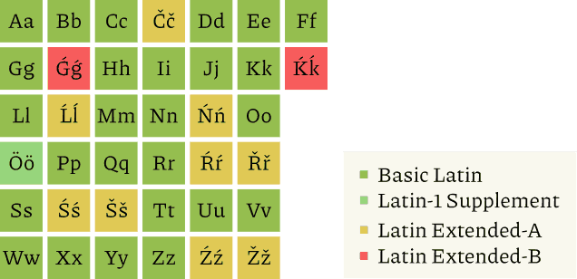

Ӟуч но удмурт калыкъёс кемаласен матын луо но, ӟуч кыллэн удмурт кыл вылэ
{ӟалкым}амезлы паймонэз ӧвӧл.  Озьы ке но, эксэй дыръя но, Кенешо Союз дыръя но
(1930. аръёсысенгес) пӧртэм-пӧртэм калыкъёслэсь кылзэс юри ӟучезлы матын карыны
тыршо вал: кылбугор, гожъяськон, куараос ласянь.  Кылъёссылэсь аспӧртэмлыксэс,
пушсӧзнэтсэс утьыны турттэм кылтодосчиосты (удмурт но, украйин но, пор но мукет)
bourgeois</i> naśjonalist">буржуа националист шуыса
гожъялозы вал[^orthography1937].  Али нош, Кенешо вакытэ юнматэм кирилик
гожъяськонзэс латӥнэ воштыны малпась калыкъёсты «эшъёссэ вузам» шуо.  Казак,
узбек, беларус кыллы кирилик тупа-а, уг-а, со шоры учкытэк, ӵапак «Росилэн
ӟалкым котыр»ысьтыз потон сярысь сюлмасько ӟуч политӥкчиос.

Та сылмытон политӥклэн одӥгез адӟиськымон бервылыз — лыдъяны луонтэм мында ӟучъя
чузъяськись, ӟучъя гожъяськись, удмурт куарасӧзнэтэз тӥясь кылъёс: *коллективизаци(я), математика, техника, Удмурти(я)*.
Кенешо вакытэ соосты «калыккуспо» шуыло вал но, пыдлось ёросъёсысь адямиос
соосты чылкыт, ӟуч сямен вераны мед быгатозы шуыса, юн сюлмасько
вал[^expedition].

Сокугес удмурт адямиосты огъя Кенешо улонэ пыртон пумысен малпаськон вал.
Валамон: югдур табере мукет луэмын.  Али ӟуч кыллы дышетон сярысь ӧвӧл, удмурт
кыллы ик дышетон сярысь малпаськоно луэ.  Кытӥяз Удмуртшаерысь пиналъёсты удмурт
кыллы — кунсьӧр кыллы кадь ик дышетоно луэ.

Куд-ог[^myths] шуэмъя, ӟуч кылысь кызьы вань, озьы ик асэстэм кылъёс, ӟучъя
гожъяськон сям удмурт кыллы нокыӵе но кышкытлык уг луо.  О-о, удмурт кылмылы али
вакытэ соос шукырес кышкытлык уг луо но, пумен-пумен тазьы кылмы пырак сылмон
калэ вуоз, дыр.  Со кылъёс лачак ванен, асьме кылмы, ӟуч кыл сярысь, котьма ке
но улӥынгес адӟиське, ас понназ азинтӥськыны уггес быгаты шуыса, пе.  Куке но
удмурт кылмес йӧгурезь быдӟа ярантэм ӟуч ӟалкымамлэсь мозытон дыр одно ик
лыктоз, лэся.

Ма, Кенешо вакытэ удмурт кылын ужамез ваньзэ сэрпалтыса, 1900. ар яке кыӵе ке
XVI дауре берытскон сярысь уг вераськы.  Татчыозь азинскыса вуэм удмурт
кылтодослэн мерассэ, пӧртэм вераськетъёсты огазе каремзэ чик куштоно ӧвӧл шуыса
малпасько.  Со вылэ инъяськыса ик, кылмес воштоно. Нош тани мынам дэмланъёсы.
Коментаръёсын малпандэс-тэргандэс вераны эн кепыралэ вал.

## Удмурт латӥн гожпуслык

Алияз удмурт гожъяськонын кӧня ке тупасьтэм интыос вань.  Ма, со небыт я чурыт
пус пуктон интыез валатэк, оло нош <i lang="tt">*сәлем</i> кылӥськем дыръя <i
lang="tt">сәлам</i> гожъяськыса, йырыд сураськыны луоно бигер гожпуслык ӧвӧл.
Озьы ке но, удмурт гожпуслыклэн но логиктэмез вань.  Кылсярысь, небыт-чурыт
ӵошлангаос но бӧрсязы мынӥсь аслангаос: «б» бӧрсьы
«э» куара мыныку, со «бе» («е» — небытатӥсь
гожпус) гожтӥське дыръя, «б» бӧрсьы «о» куара мыныку, со «бо» ик
гожтӥське («о» берло ӵошлангаез уг небытомыты).

Удмурт гожъяськонлэн азинскемез нырысь ик палэнысь учыръёсын герӟаськемын
[^writing].  Алиез удмурт гожпуслык 1918. ар котырын юнмам но, со дырысен
чутырак воштӥськонъёс вылымтэ.  Озьы ке но, соин-маин куанымтэос вал.
Кылсярысь, соку небытэзлэн но чурытэзлэн ужпумзылы сэрттон-пертчон сётыны
турттэм Алатырёв аспирантлэсь малпамзэ (Я, Ю, Е, Ё,
Й гожпусъёсты алфавитысь поттыса, небыт
ӵошлангаосты ваньзэ бӧрсязы небыт пусэн гожтыны) Кенешо Союз дыръя палэнтӥллям,
Алатырёв *«тыпак калыккуспо кылъёсты — огласянь, но мукет ласянь — дышетӥсьёс
ёрмоно ӟуч кыллы дышетонэз лыдэ уг басьты*» шуыса[^orthography1937].  Отӥяз:
«*Алфавитэз воштон ласянь ужпумез верано ке,
одӥг тусэ вуттон сярысь гинэ вераны луэ; удмуртъёс гинэ ӧвӧл, ваньмыз пичи
национальносьёс но гожъяськонзэс [ӟучезлы] матэгес карыны кулэ*».

Удмурт кыллэн выль гожпуслыкезлы латӥн гожпуслыкез быръёно шуыса малпасько.
Латӥнлык асьмемыз ӧжыт ке но мукет суоми-угор но тюрк калыкъёслы матынгес кароз но, ӟуч кыллэн меӵак
ӟалкымлэсь мозмытоз.

«Роси Федерациысь калыкъёслэн кылъёссы
пумысен» катъя, элькун кылъёс кирилик вылэ инъям гожпуслыкен гинэ луыны кулэ.
Соин, латӥнлыкез али ик паськыт уже кутон сярысь малпанэз но ӧвӧл.  Со сяна,
выль гожпуслык пуктоно ке, сое нырысь-валысь ик пӧртэм кылтодосчиос рос-прос
эскерыны но дунъетсэс сётыны кулэ.

### Гожпусъёс

Татын 38 гожпуслэсь латӥн алфавит но кирилик
гожпуслыкен тупанэз сётэмын.  Курсӥвен возьматэм гожпусъёс литэратур удмурт
кылын уг пумисько но тупаса воштӥськыны вуымтэ кылъёсын, аснимъёсын оло
вераськет кылъёсын кутӥсько.  Удмурт кыллы мурт луись куараосты возьматыны нимаз
гожпусъёс юри пыртэмын ӧвӧл.

| Латӥн | Кирилик                               | IPA     | Возьматос       |
|-------|---------------------------------------|---------|-----------------|
| Aa    | Аа       | [ä ~ ɑ] | **A**naj        |
| Bb    | Бб       | [b]     | Lum**b**yt      |
| Cc    | Чч       | [t͡ɕ]    | **C**ukinder    |
| Čč    | Ӵӵ       | [t͡ʂ]    | **Č**ana        |
| Dd    | Дд       | [d]     | **D**araĺi      |
| Ee    | Ээ       | [ɛ ~ e] | Ĺ**e**mĺet      |
| *Ff*  | Фф       | [f]     | **F**ederal     |
| Gg    | Гг       | [g]     | **G**erber      |
| Ǵǵ    | Дьдь     | [ɟ]     | Ma**ǵ**jar      |
| *Hh*  | Хх       | [x]     | **H**orvat      |
| Ii    | Ии       | [i]     | S**i**-bur      |
| Jj    | Йй, ъ, ь | [j]     | **J**övaĺeg     |
| Kk    | Кк       | [k]     | **K**apka       |
| Ḱḱ    | Тьть     | [c]     | **Ḱ**amys       |
| Ll    | Лл       | [ɫ]     | Ka**l**yk       |
| Ĺĺ    | Льль     | [lʲ]    | **Ĺ**ibyt       |
| Mm    | Мм       | [m]     | **M**amyk       |
| Nn    | Нн       | [n]     | **N**amer       |
| Ńń    | Ньнь     | [ɲ]     | Ka**ń**yl       |
| Oo    | Оо       | [ɔ]     | G**o**ndyr      |
| Öö    | Ӧӧ       | [ə]     | P**ö**rtem      |
| Pp    | Пп       | [p]     | **P**aleź       |
| *Qq*  | Кк       | [k]     | **Q**atar (кун) |
| Rr    | Рр       | [r]     | A**r**          |
| Ŕŕ    | Ӟӟ       | [ɟ͡ʑ]    | **Ŕ**ec         |
| Řř    | Ӝӝ       | [d͡ʒ]    | **Ř**akyjyr     |
| Ss    | Сс       | [s]     | **S**ylal       |
| Śś    | Сьсь     | [ɕ]     | **Ś**am         |
| Šš    | Шш       | [ʂ]     | **Š**yr         |
| Tt    | Тт       | [t]     | **T**ol         |
| Uu    | Уу       | [u~w]   | P**u**l         |
| Vv    | Вв       | [v]     | **V**al         |
| *Ww*  | Вв, Уу   | [w]     | **W**illiam     |
| *Xx*  | кс       | [ks]    | Man**x**        |
| Yy    | Ыы       | [ɪ̈]     | L**y**my        |
| Zz    | Зз       | [z]     | Ju**z**yr       |
| Źź    | Зьзь     | [ʑ]     | Muresa**ź**     |
| Žž    | Жж       | [ʐ]     | Y**ž**          |

Куд-ог вераськетъёсын пумиськись куараосты гожтыны вылысь, нимаз гожпусъёсты уже
кутыны луэ: кылсярысь, **Əə**, **Üü**, **Ññ**.  Быръем гожпусъёс тросэз
огшорыесь гинэ шуыса малпасько.  Кылсярысь, тодослыко гожтонын, эрзя латӥнлыкын
со выллем гожпусъёс ик кутӥсько.

Ӵошлангаослэн небытсэс возьматыны бӧрсязы мынӥсь аслангаос ӧвӧл, вадьсазы акут
шуон (◌́) диакритӥк пусъёс кутӥсько.  Соин, *ся*
интые *śa* гожтӥськомы.  Йот понэм аслангаос (*я*, *е*,
*ё*, *ю*), кыл азьын, мукет асланга бӧрсьын, чурыт я небыт пус бӧрсьын
(чурыт но небыт пусъёсты ум ни гожтӥське) дыръя, кык гожпусэн гожъясько: *ja*,
*je*, *jo*, *ju*.

Юнӥкодын акуто **Dd** но **Tt** гожпусъёс ӧвӧл
но, небыт /дь/ но /ть/ куараосты гожтыны **Ǵǵ** но **Ḱḱ**
гожпусъёсты бырйи.  Логиктэм адӟиське, дыр, ке но, логикез вань.  Нырысетӥез,
мадьяръёслэн /дь/ куаразы **gy**
кадь гожтӥське (аснимзы — <i lang="hu">magyar</i>).  Кыктэтӥез, удмурт кылын
д—г, т—к выжтон учыръёс вань: *кыкъямыс* кыл
(ӵошатэ: коми <i lang="kv">кӧкъямыс</i>) бератаз *тямыс* луэм но, *Татьяна,
Денис* нимъёс *Такъян, Генис* луиллям.  Та
гожпусъёсты бырйыса, огкадь луэмзы шонерак адӟиське.

Жаляса верано, та гожпусъёс Юнӥкодлэн Latin
Extended-B люкетаз пыро, соин соосты возьматӥсь шрифтъёс ӧжытгес вань.  Озьы ке
но, <i lang="en">Unicode-aware</i> шуон шрифт возьматон тӥрлык соосты асэрказ
поттыны быгатоз.

**Ӝж**, **Ӟӟ** куараосты возьматыны кӧня ке быръён
вал: я **ǵź** но **dž** дӥграфъёс, я **Ʒʒ** но **Ǯǯ** гожпусъёс, я, бератаз,
**Ŕŕ** но **Řř** гожпусъёс.  Одӥг пусэн гожтымон мае ке кык пусэн гожтонэз
тус-тас карон кожасько, соин нырысетӥзэ быръёнэз сэрпалтӥ.  **Ʒʒ** но **Ǯǯ**
гожпусъёс озьы ик Юнӥкодлэн Latin Extended-B
люкетаз пыро но, аслам малпамея соос домбылёгес адско.  **Ŕŕ** но **Řř**
логиктэм вылымтэ: мукет суоми-угор кылъёсын кыл азьысь /р/ куара удмурт /ӟ/ но /ӝ/
куараосы выже (ӵошатэ: коми <i lang="kpv">рыт, руч, роч</i> но удмурт <i
data-latin-skip>ӝыт, ӟичы, ӟуч</i>).

**Ǵǵ**, **Ḱḱ**, **Ŕŕ** но **Řř** пусъёс аспӧртэмлыкоесьгес луо но, соослы кӧня
ке дышоно оло мукет мае ке кутоно.  Небыт /дь/ но /ть/
куараосты возьматыны озьы ик **Ďď** но **Ťť** гожпусъёсты уже кутыны луысал, дыр
(словак но чек кылъёсын соос огвыллем кураоасты возьмато).  Озьы ке но, соос
мукет акуто пусъёслэсь висъяськогес.

#### Юнӥкод

<figure>

<figcaption>Кудӥз гожпус Юнӥкодлэн кудаз
люкетаз пыре</figcaption>
</figure>

Тросэз гожпусъёс Юнӥкодлэн Basic Latin я
Latin-1 Supplement люкетъёсаз пыро, соин тросысьтыз шрифтъёсысь соосты шедьтыны
луэ; Latin Extended-A озьы ик ӵем пумиське.  Latin Extended-B люкетэ пырись
**Ǵǵ** но **Ḱḱ** гожпусъёс шрифтъёсын шергес пумисько ке но, вылӥын верам сямен
ик, <i lang="en">Unicode-aware</i> шрифт возьматон тӥрлык соосты асэрказ **Gg**,
**Kk** но ◌́ пусъёслэсь поттоз (кылсярысь, {вотэсучкон}ъёс, тэксттупатӥсьёс,
XeLaTeX выллем тырон-шуккон тӥрлык).

Basic Latin люкетэ пырись пусъёс UTF-8 кодъянын одӥг {тямысо} басьто.  Соин,
гожпуслы быдэ котьку кык тямысо басьтӥсь кириликен ӵошатыса, латӥнэн гожтэм
тэкстлэн лыдпусо кабен быдӟалаез ичигес луэ.

### Шонеррадъёс

1. *лля, лле, нне, ння* выллем куаратэчетъёсын
   (кылӥтэтъёс огазе вуэм интыосын сяна) кыксэ ик ӵошлангаез небыт гожтоно:
   *vyĺĺem*, *uliĺĺam*, *peceńńa*, *duńńe*; *kylĺukam* (пӧртэм кылвыжыос).

1. Кириликен *ц, щ* гожтэм куаратэчетъёсты *ts, šč*
   гожтоно: *švejtsar*, *boršč*.

1. Асэстэмъёсын удмурт кылын небыт луисьтэм ӵошлангаослэн небытсэс бӧрсязы *j*
   гожпусэн возьматоно: *slavjan*.

1. Туж выль асэстэмъёсты тупатытэк ик гожтыны яра: *horror*, *fake*,
   *maki-zushi*.

1. Мурт кылысь аснимъёсты (инты нимъёсты, адями нимъёсты но мук.), соосты удмурт
   кылын гожтон сям вань ке, озьы ик гожтоно:

   * *Москва* луэ *Musko*;
   * *Казань* луэ *Kuzon*.
  
   Сыӵе сям ӧвӧл дыръя, латӥн гожпуслыкен гожтон дышем сямъягес гожтоно:
  
   * *Израиль* (Шор Ӵукпалась кун) луэ *Israel*;
   * *Миядзаки* ({Нипоншаерысь|Нипоншаер}
     префектур, тодмо нипон анӥматорлэн выжынимыз) луэ *Miyazaki*;
   * *Татабанья* (Мадьяршаерысь кар) луэ
     *Tatabánya*.

1. Лыдпусъёсын гожтэм радлыко лыднимъёсты пумазы дугдонпусэн («.») гожтоно:

   * *2-тӥ суред* луэ *2. sured*;
   * *4-тӥ шуркынмон* луэ *4. šurkynmon*.
   * *2022(-тӥ) ар* луэ *2022. ar*.

Берлогес асэстэм кылъёс сярысь улӥынгес верасько.

### Примеръёс

Удмурт Элькунлэн кункрезез (люкетэз)

Šundy śios řuato paleźez, 
Jug ŕardon vue muzjemam. 
Oskon tölpo — miĺemly Kunšeted, 
Dan tynyd, Dore mynam!

Jugdyty, Bydŕym Inmare, 
Kyǵokyś invisjosmes, 
Kydaty vyĺ šudburmes, 
Eriko, jön burdjosmes!

Куӟебай Гердлэн «Матӥ»ез (кутсконэз)

Malpaśko ke, kemalaś ik öj val kaǵ so…

Tače ik śin aźam pukśe.

Mati nyljosmurt val.  Vań kalyk kotyr jorosyś tode val soje.  Ceberez šory
uckysa, kötsy ug tyry val…

Ma, kyźy uz ucke!

So śana, nomyr as ceberenyz śinez ug erkija val.  Kotyr teĺjos, byrontem ńurjos,
mučjos.  Korkaossy udmurtjoslen nacareś: śintem kyšnoos kaǵeś, picijeś uknojo.
Kalyk no, korkaosyz kaǵ ik, śintem… śekyt užez užasa gubyrmemyn, užen muzjem
bordy packatemyn…

Śaśka kaǵ ceber val Mati!

Śaśka śamen ik šujaz… šujaz — žaĺatek soje derije ĺogazy.

Геннадий Красильниковлэн «Арлэн кутсконэз», 1. йыретэз
(кутсконэз)

Korka puškyn řomo-jugdo gine aĺi, samoj ceskyt ummen iźon vakyt, noš uramyn
aǵami kuaraos kyliśko ńi, otyn no tatyn kapkaos, ybesjos ŕukyrtylo.  Pudozes
urame pottysa, kyšnomurtjos ogzyly ogzy śures vamen vaźylo.  Pudo uĺĺojez ujysa,
berges sajkam kyšnomurt skalze ńöryn šukkylysa uĺĺa, goĺyk pydaz ponem kološajez
byźon kuspaz uśysa kyĺe.  Jegit na kyšnomurt, aĺiges gine byźemyn.  Gužem kuaźen
pudojez voź vyle tuž vaź potto, soku jegit murtjosly skalen jyrin ug luy na-aj…

Пус лыдъя латӥнлыкен гожтэм тэкст 1&thinsp;%:лы ёрос ичигес луэ — кулэтэм небыт
пусъёс куштӥсько.  Йот понэм аслангаос (*я*, *е*, *ё*,
*ю*) кытӥяз одӥг гожпус интые кык гожпус карисько но, со туж ик шӧдымон
ӧвӧл.  Со сяна, UTF-8:эн кодъяса, инъетась латӥн гожпусъёс одӥг тямысо (кык
интые) басьто бере, лыдпусо кабен ыстыса, латӥнлыкен гожтэм тэкст уката ик
пичиёме.

Кыӵе ке тэкстлэсь та латӥнлыкен туссэ эскеремды потэ ке, танӥ аутоматӥк
берыктонэз лэсьтыны тыршиськем.  (Вужгес вотэсучконъёсын уз ужа, дыр.)

  

    <textarea
      id="transl-textarea"
      rows="3"
      aria-controls="transl-output"
      placeholder="Татчы тэкст пыртэ"></textarea>
    <button
      id="transl-clear"
      class="translator__clear"
      title="Бушатоно"
      aria-controls="transl-textarea">
      <svg class="icon">
        <use href="/assets/icons/sprite.svg#close-line"/>
      </svg>
    </button>
  

  

## Ӟучысь выльгес асэстэмъёсты тупатон

Ваньзэ кунсьӧр кылъёсты удмурт выжыосын воштыны луонлы мон уг оскиськы.  Ма,
соиз кулэ но ӧвӧл, дыр.  Троссэ огшоры гинэ удмурт куарасӧзнэтлы тупатоно.
Мынам тодэмея, удмурт кылэ пырись асэстэмъёсты юри, пыр-поч удмурт куарасӧзнэтлы
тупатон уж ноку но ӧй вал, адямиос но ӟуч сяменгес верало вал (нимысьтыз верано
ке, азькылын верам Кенешо дыръя ёросъёсысь адямиосын ужлы луыса).  Озьы ке но,
али таӵе ужез нуыны уг луы шуыса, со уг вера.

Асэстэм кылъёсын кӧня ке амалэн ужаны луэ:

### Удмурт кылын луись кылъёсын воштон

Кылсярысь, *аренда* интые *кертоман*, *закон* интые *кат*, *система* интые *сӧзнэт*, *Елабуга* интые *Алаб(у)го* шуыны луэ. Озьы ик удмурт
выжыослэсь выль кылъёс малпалляны луэ.  Куӟебай Герд ас вакытаз трос гинэ выль
удмурт кыл малпаз вал; выль кыл кылдытонэн рос-прос ужамын пӧртэм ӵектосъёс,
кылсярысь, 2010. аръёс кутсконысьгес #МалпаВыльКыл
ӵектос.

Татын тунсыко потозы, дыр, [{Нимкылӧри}лэн ужамез][terminology-committee] но
[«Удмурт кылъёс» тэлеграм канал](https://t.me/udmkyl).

Кун (шаер) нимъёсты воштон пумысен малпанэ вань.  Али соос тыпак ӟучъя верасько
(Удмурт шаермылэн нимыз но!).  Мынам малпамея, троссэ кун нимъёсты калык
нимъёслэсь, -шаер итэт ватсаса, пӧрмытыны луэ.  Кылсярысь: *Удмуртшаер*,
*Комишаер*, *Мадьяршаер*, *Суомишаер*, *Прансузшаер*, *Немычшаер*,
*Украйиншаер*, *Нипоншаер* (яке *Японшаер*) но мук.  Та эсэпысь потӥсь нимъёс:
*Роси* (тодмо мугъёсъя али вакытэ сое *Ӟучшаер* шуыса умой ӧвӧл); *Исраэль*,
*Катар*, *Бахрайн*; *Беларусь* (*Беларусшаер* сярысь, таиз умойгес чузъяське
кадь); *Кыргызстан*, *Казакстан* выллем *-стан* итэто нимъёс; *Аустрали* но мук.
*Татарстан* интые *Бигершаер* шуыны яра но, Даур ТВ:ын шуон сямъя *Бигерстан*
шуыны чик уг яра.  Та выллем нимпӧрмонэз мадьяръёс (<i
lang="hu">Magyarország</i>, <i lang="hu">Németország</i>, <i
lang="hu">ország</i> — *шаер*) но комиос (<i lang="kv">Комиму</i>, <i
lang="kv">Рочму</i>, <i lang="kv">му</i> — *му, музъем*) уже куто.

### Ӟуч пормаосты тупатон

Кылсярысь, *фонарь* интые азьло удмурт кылын кутэм
*понар* пормазэ, *конфета* интые *кампет* пормазэ
уже кутыны яра.  Озьы ик *француз* интые *прансуз*,
*немец* интые *немыч* [^nemyc], *фабрика* интые *пабрек* шуыны луэ.  Выльгес примеръёсты
верано ке, Дарали Лели малпам *модали* (модель луыса
ужась) кылэз тодэ вайыны луэ.

Ваньзэ ик кылъёсты удмуртъёсыныз воштыны оло мукет (ӟуч луисьтэм) кылысь
асэстыны уг луы (малы чырыез пырыен воштонэз?).  Шуом, *урок* кылэз (ксь,
школаын урок) кызьы воштод меда?  Сыӵе кылъёсты кӧня ке тупатъяса гинэ кельтоно
кадь.

### «Выльысь» асэстон

Ваньмыз сямен кунсьӧр кылъёс удмурт кылэ ӟучез пыр пырылэмын но ӟучъя гожтӥсько,
ӟучъя чузъясько.  Соин нюръяськыны вылысь, со кылъёсты выльысь, ӟучезлэсь пӧртэм
луись кылъёсысь асэстыны луэ шуыса малпасько.

(Ӝытпал) Эуропысь лыктэм кылъёсты вераса, соосты прансуз, немыч кылъёсысь
басьтыны луэ, отын со кылъёс пормазыя удмуртлы туж укшало бере (кылсярысь,
удмурт кылын кадь ик, прансуз кылын юнверан берпум ёзлы усе).  Культур мугъёсын
мукет кылъёсысь асэстыны но луэ.

Эуроп кылъёсты асэстонын таӵе огъя шонеррадъёсты кутоно (татын асэстэм пормаез
латӥн гожпусъёсын, вылӥын верам сямъя сётӥсько):

1. Юнверан котьку сямен кыллэн берпум ёзаз усе.

1. Кыкто ӵошлангаосты асэстонын одӥго кароно: пр.
   <i lang="fr">classique</i> — *klasik* (классик,
   классической), нем. <i lang="de">Effekt</i>
   — *efekt*.

1. Роман кылъёсын *gn, nh, ñ* гожпусъёсын возьматэм ӵошлангаез небыт *ń* кароно:
   пр. <i lang="fr">compagnie</i> — *kompańi*
   (компания).  *Gn* кык ӵошлангаез возьматэ дыръя, озьы
   ик кельтоно: пр. <i lang="fr">agnostique</i> —
   *agnostik*.

1. Эуроп «небыт *l*» куараез небытаса кельтыны луэ (ӵемысь ик *e*, *i* куараос
   азьын, кыл пумын): нем. <i
   lang="de">Telegramm</i>, пр. <i
   lang="fr">télégramme</i> — *teĺegram* оло *telegram* (телеграмма).

1. Ваньзэ мукет ӵошлангаосты чурыт возёно: <i lang="de">Universität</i> —
   *universitet* (университет).

1. Тодметним пумын *-if* ӧвӧл, *-iv* гожтоно: пр.
   <i lang="fr">productif</i>, нем. <i
   lang="de">produktiv</i> — *produktiv*.

1. Кык асланга куспын, жингрес ӵошланга азьын *s*, *σ* гожпусъёсын возьматэм
   куараосты *z* кароно: *kapitalizm* (капитализм),
   *izometri* (изометрия).

1. *Th, θ* гожпусъёсын возьматэм ӵошлангаез чурыт *t* кароно: пр. <i lang="fr">mathématique</i> — *matematik* (математика).

1. Грек *χ* куараез *k* кароно: *teknologi*.

1. (Латӥн, грек кылысь лыктэм) *au*, *ou*, *eu* дӥфтонгъёсты озьы ик
   гожтӥськомы: *automatik*, *Europ*.

1. *Y*, *υ* гожпусъёсын возьматэм аслангаез *i* гожтоно: пр. <i lang="fr">stylométrie</i> - *stilometri*.

1. {Шаратэм} но бӧрсяз мынӥсь жингрес ({ньыл-ньыл}) ӵошлангаос куспы *ы*, *о*
   асланга ватсаны луэ (уката ик кылпумын): пр. <i
   lang="fr">semestre</i> — *semestyr*, <i lang="fr">mètre</i> — *metyr*, <i
   lang="fr">article</i> — *artikol*.

Каронкыл кылдытонын 2. вошъяськет (*-аны*, *-яны*) продуктӥв луэ: *programjany*
(<i lang="fr">programmer</i>, программировать),
*reprezentjany* (<i lang="fr">représenter</i>, репрезентировать), *klasifikjany* (<i lang="fr">classifier</i>,
классифицировать), *dekolonizjany* (<i
lang="fr">décoloniser</i>, деколонизировать).  *-ция* (*-tion*) кылпумо кылъёсты со каронкылъёсысь ик, *-н*
кылӥтэт ватсаса пӧрмытэм макенимъёсын воштыны луэ: *dekolonizjan* (<i
lang="de">décolonisation</i>).  Меӵак каронкыл пуштроссы ӧвӧл *-tion* кылпумо
кылъёсты со кылӥтэтэн ик кельтыны луэ: *funkśjon* (<i lang="de">Funktion</i>),
*revoluśjon* (<i lang="de">Revolution</i>).

Мукет кылъёсысь асэстэмъёсын нимаз шонеррадъёсъя ужано.  Кылсярысь, украйин
кылысь асэстэмъёсын *и* гожпусэн возьматэмез котьку ик *ы*, *ї* гожпусэн
возьматэмез *йи* карыса гожтоно: <i lang="uk">Київ</i> — *Kyjiv* (Киев).

Нипон кылэз верано ке, таӵе шонеррадъёсты уже кутыны луэ шуыса малпасько:

1. に (ni), し (shi) канаен возьматэм ёзъёсты небыт *нь*, *сь* куараен гожтоно: <i
   lang="ja">アニメ</i> (anime) — *ańime*, <i lang="ja">寿司</i> (sushi) -
   *suśi*.  Ваньзэ мукет ӵошлангаосты чурыт кароно.

1. じ (ji) канаен возьматэм ёзъёсты *ӟ* куараен гожтоно: <i lang="ja">柔道</i>
   (jūdō) — *ŕudo*, <i lang="ja">漢字</i> (kanji) — *kanŕi*.

Нош нипон кылысь асэстэмъёс туж вылесь луо бере, соосты (лыдӟонзэ валаны быгатыны
луоно дыръя) ромаӟиен ик кельтыны луэ: *anime*, *sushi*, *judo*, *kanji*.

Ӟучезлэсь юри пӧртэм карыны тыршоно ӧвӧл.  Кылсярысь, англи <i
lang="en">cursor</i> ӟучен огвыллем ик *kursor* кылэз вордоз.  Удмурт
куарасӧзнэтэз со уг тӥя, соин сюлмаськонэз ӧвӧл.

Бератаз ини, та шонеррадъёсъя поттэм куд-ог кылъёсты улӥын сётӥсько.

| Выльысь асэстэм | Ӟуч                                    | Ӵошатэ                                                                |
|-----------------|----------------------------------------|-----------------------------------------------------------------------|
| program         | программа       | нем. Programm       |
| komunist        | коммунист       | нем. Kommunist      |
| manifest        | манифест        | пр. manifeste      |
| manifestjany    | манифестировать | пр. manifester     |
| dekolonizjan    | деколонизация   | пр. décolonisation |
| politik         | политика        | пр. politique     |
| parti           | партия          | пр. parti(e)      |
| prefektur       | префектура      | нем. Präfektur      |
| universitet     | университет     | нем. Universität    |
| matematik       | математика      | нем. Mathematik     |
| literatur       | литература      | нем. Literatur      |
| teknologi       | технология      | нем. Technologie    |
| geografi        | география       | нем. Geografie      |
| kimi            | химия           | пр. chimie        |
| fizik           | физика          | нем. Physik         |
| teori           | теория          | пр. théorie       |
| kompańi         | компания        | пр. compagnie     |
| kampań          | кампания        | пр. campagne      |
| sertifikat      | сертификат      | пр. certificat    |
| sertifikjany    | сертифицровать  | пр. certifier     |
| semestyr        | семестр         | пр. semestre      |
| efektiv         | эффективный     | нем. effektiv       |
| mašin           | машина          | пр. machine       |
| integral        | интеграл        | пр. intégral      |
| operator        | оператор        | пр. operateur     |
| linear          | линейный        | нем. linear         |
| funkśjon        | фукнция         | нор. funksjon      |
| matris          | матрица         | пр. matrice       |
| aproksimjan     | аппроксимация   | пр. approximation |
| Europ           | Европа          | пр. Europe        |
| Afrik           | Африка          | пр. Afrique       |
| Kyjiv           | Киев            | укр. Київ         |

[^expedition]: [Удмурт кыл ужпумъёс сярысь
    материалъёс](https://elibrary.unatlib.ru/handle/123456789/23725) : Удмурт
    Республикаысь нырысетӥ кыл конференция азелы : обсуждать карон вылысь / Удмурт социокультураез
    научно-эскерон институт. — Ижкар : Удмуртгиз. — 1937. — 8. бамыз.
[^orthography1937]: *Бабинцев, Анатолий Сергеевич*. [Удмуртская
    орфография : (тезисы) : в порядке обсуждения к Первой удмуртской языковой
    конференции](https://elibrary.unatlib.ru/handle/123456789/25525) [ӟуч
    кылын] / А. С. Бабинцев ; Удмуртский
    научно-исследовательский институт соцкультуры при СНК УАССР. — Ижкар:
    Удгиз, 1937. — 10.
[^myths]: [Десять мифов об удмуртском
    языке](http://www.udmurt.info/udmurt/10myths.htm) [ӟуч кылын] / Удмуртология.
[^writing]: *Сахарных, Д. С.* [К реконструкции истории
    удмуртской
    письменности](http://web.udmurt.info/pdf/texts/udmpism.pdf) [ӟуч
    кылын] / Удмуртология — 2008.
[^nemyc]: «Немыч» али ӵемысь ик тылобурдоез шуо ке но, азьвылгес ошмесъёсын
    «немец» интые кутонэз но пумиське ([Удмурт
    коммуна](https://elibrary.unatlib.ru/handle/123456789/15914). 1930,
    №&thinsp;112 (18. куартолэзь). 3. бамыз; *Волков, М. И.* [Парсь
    Петя](https://elibrary.unatlib.ru/handle/123456789/26225). 1927. 8. бамыз).

[terminology-committee]: http://storage.ning.com/topology/rest/1.0/file/get/1559706789?profile=original
[typography-layout]: https://ilyabirman.ru/typography-layout/
