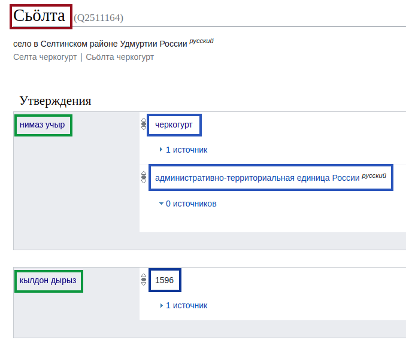
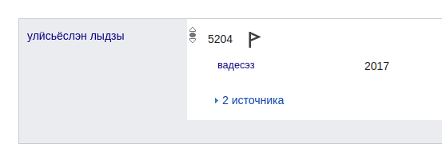
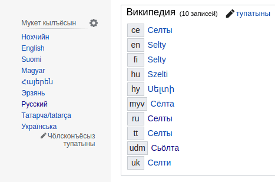

[Викидата][wikidata] (яке Викиданнойёс) со Викимедилэн (Википеди котырын ужась 
огазеяськонлэн) тодэтъёсты машиналы валамон, радъям сямен возён проектэз. Со 
али но трос пайда вайылэ, азьланяз но, улонмы лыдпусо кариськемъя, кулэлыко 
кылёз, малпасько. Нош ваньзэ радызъя вералом.

Викидата нырысетӥзэ усьтэмын вал 29. коньывуонэ 2012 арын, туэ 9 ар тырмонзэ 
пусйиськомы.

## RDF

Викидаталэн ёзрадыз <abbr title="Resourse Description Framework">RDF</abbr> 
вылэ инъямын. Со Дунневыл Вотэс Консортӥумлэн (W3C) радъям тодэтлы стандартэз 
но ас понназ ик вераськымон арбери.

RDF:я ваньмыз куиньмоосын (*верамъёсын*) валэктӥське: *субъект — предӥкат — 
объект*:

```turtle
# Возьматон понна гинэ псэудокод

# субъект предӥкат           объект
<Сьӧлта>  <луэ>              <черкогурт>;
          <кылдон_дырыз>     "1596"^^xsd:dateTime;
          <улӥсьёслэн_лыдзы> 5204.
```

Озьыен тодӥмы, Сьӧлта 5204 улӥсен 1596 арын кылдэм черкогурт шуыса. Викидатаын 
со тазьыгес валэктэмын:

<figure>

<figcaption>
<a href="https://www.wikidata.org/wiki/Q2511164">Сьӧлта черкогуртлэн Викидатаысь бамыз</a>. Гордэн возьматэмын 
субъектэз, вожен — предӥкатэз, лызэн — объектэз.
</figcaption>
</figure>

Арберилы быдэ нимысьтыз QID сётэмын (азяз Q гожпусэн лыд), мукет арберилэн та 
ик QID уз лу. Тазьы одӥг нимъем арбериосты ог-огзылэсь висъяны луэ.

Предӥкатъёс субъектлэсь кыӵе ке аслыксэ возьмато. Соос но нимаз лыдзыя тодмо 
луо: кылсярысь, Сьӧлталэсь кылдэм дырзэ Викидатаын [P571 аслыкен][P571] 
валэктӥллям.

Предӥкатлэн пуштросэз огшоры маке (лыд, чур) яке мукет арбери луэ. Википедиын 
кадь ик, ваньмыз ваньмыныз герӟамын.

Викидата ас понназ улӥсь онтологи (валанбугор) луэ. Кыӵе ке аслыкъёс, валанъёс 
уг тырмо ке, со ачиз ик соосты кылдытоз.

Кабес RDF:лэсь пӧртэм луыса, верамъёслэн *квалификаторъёссы* но *ошмесъёссы* 
вань. Квалификаторъёс верамлэсь югдурзэ возьмато. Одӥгез ӵем пумиськись
возьматосэз луэ дыр вадес.

<figure>

<figcaption>
<a href="https://www.wikidata.org/wiki/Property:P585">«Вадесэз» аслык</a> валэктэ, ку улӥсьёслэсь верам лыдзэс тодӥллям.
</figcaption>
</figure>

Ошмесъёс верамлэсь кытысь потэмзэ возьмато, зэмлыкез мед возиськоз шуыса.

## Куронъёс

Мынам малпамея тунсыкоез — куронъёс лэсьтыны. Ваньзэ та люкам тодэтэз 
автоматлыко эскерыны луэ, йӧспӧртэм куронъёс келяса: кӧня Удмуртшаерын вордскем 
адямиос кыӵе ке данъет басьтӥллям, кудӥз вылӥдышетсконни уногес тодослыко 
статья поттэм, ма ужбергатонниослэн кунсьӧр ёзэтсы вань но озьы азьлань.

Гуртэ ужме лэсьтыса берпуметӥзэ куронэз гожтӥ но нырысь-валысь медытэк тодӥ, 
Тогоын, кылсярысь, калыккуспо банк вань шуыса:

```sparql
SELECT ?corp ?corpLabel (SAMPLE(?stateLabel) AS ?state)
WHERE {
  ?corp wdt:P31/wdt:279* wd:Q6881511;
        wdt:P17 ?state;
        wdt:P355 ?subsidiary.
  MINUS { ?subsidiary wdt:P17 ?state. }
  SERVICE wikibase:label {
    bd:serviceParam wikibase:language "[AUTO_LANGUAGE],en".
    ?corp rdfs:label ?corpLabel.
    ?state rdfs:label ?stateLabel.
  }
}
GROUP BY ?corp ?corpLabel
HAVING (COUNT(DISTINCT ?subsidiary) > 1)
```

> [Асьтэлэн куронэз быдэстэмды луэ](https://w.wiki/4HFr)

Куронъёс RDF:лы лэсьтэм [SPARQL][sparql-tut] кылын гожъясько. Тодмо куиньмоосты 
адӟиськомы, соос таре QID но PID:ъёсын нимамын ке но. SQL:ез тодӥськоды ке, туж 
ик секыт луыны кулэ ӧвӧл.

## Малыез

Викидатаез трос амалэн кутыны луэ. Пичизэ вераса, ушъян-ӵектон кампаньёсты 
эскерон, визьсынанъёс лэсьтон, котьку азьлане мынымон. Нош тани мар со Викимеди 
сӧзнэтын ик каре:

### Огазея

<figure class="float-right">

</figure>

Усьтӥськыкуз ик, Викидата троскылъем Википедиез ваньзэ огазе карыны турттэм. 
Али котькуд QID:лэн пӧртэм кылъёсын Википедиосысь герӟам статьяосыз вань. Со 
QID:ъёс пыр ай ӟуч кылысь удмуртэ, англиысь немыче выжеммы луэ.

Азьло гожъясь ачиз ваньзэ чӧлсконъёсты нимаз гожтоно вал.

### Туннала возе

Википедилэн вань 312 ужась версиез, ваньмаз но тодэт туннала калын луыны кулэ. 
Но солы кужым ноку но уз луы, туж мылкыд каримы ке но. Викидаталэн татын 
асьмелы юрттэмез луэ, котьку берлозэ тодэтэз сётыса ваньмыныз кылын.

Алиез сярысь вераса, Викидатаысь тодэтъёс статьяосысь куд-ог пулъёсын 
(infobox:ъёсын) кутӥське. Умояз югдурын соин ваньмыз таблицаос, лыдметъёс 
тырмоно.

Мукетыз тунсыко проект [Абстракт Википеди][abstract] луэ. Со чакла статьяослэсь 
текстсэс ик Викидатая гожъяны. Соин, статья Викидаталэн куд-ог функциез луэ:

$$\text{article} = f(x_1,x_2,x_3,\ldots).$$

Озьы статьяос туннала калын гинэ ӧвӧл, мыдлань малпанъёстэк но луозы, 
тодэтъёсты тупатыны ваньмызлэн луоз бере. Пичигес кылъёсын но тросгес ивортодэт 
кылдоз — функци гинэ лэсьтоно, мукетыз ни асэрказ кариськоз.

Уг малпаськы, озьы ке но, ваньзэ статьяез озьы печатланы луоз шуыса, нош 
нырысетӥ чуръёссэ малы уз.

---

Туэ сӥзьылысен гинэ ӟечгес тодматски та проектэн но луонлыкъёсызлы туж 
синмаськи. Ваньдэсты пыриськыны, удмурт Викидатаез улӟытыны ӧтисько!

[wikidata]: https://wikidata.org/
[sparql-tut]: https://wdqs-tutorial.toolforge.org
[abstract]: https://meta.wikimedia.org/wiki/Abstract_Wikipedia
[P571]: https://www.wikidata.org/wiki/Property:P571
